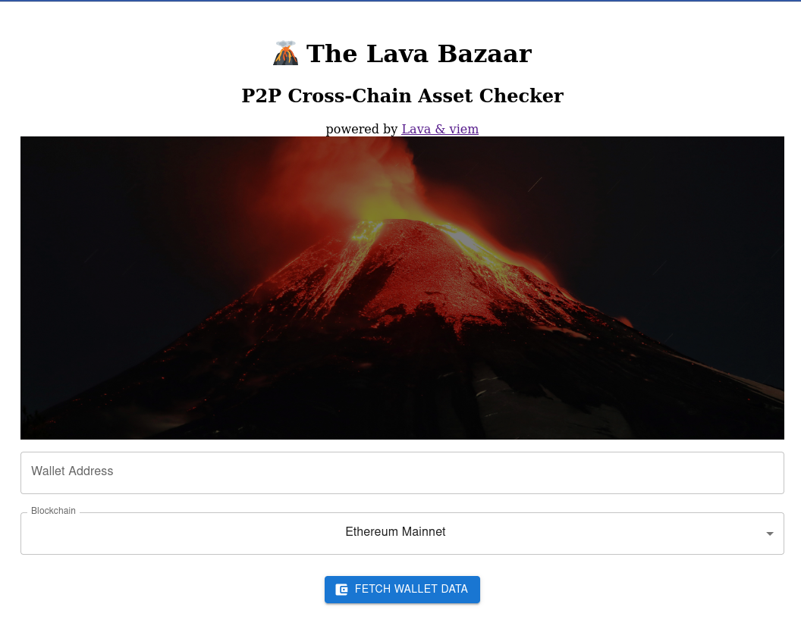
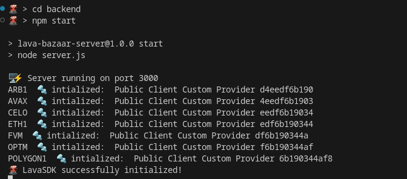
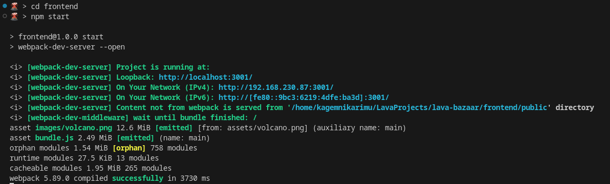

# 🌋 The Lava Bazaar

A cross-chain asset tracker using p2p RPC. A demo app which makes use of the [`lava-viem` integration](https://docs.lavanet.xyz/viem).
Quickly check the balance of any wallet across supported blockchains. No RPC URLs were harmed in the making of this application!

## Try it Out!



### Start the Backend

```bash 
cd backend
npm install
npm start
```



### Start the Frontend

Once the backend is running!

```bash
cd frontend
npm install
npm start
```

